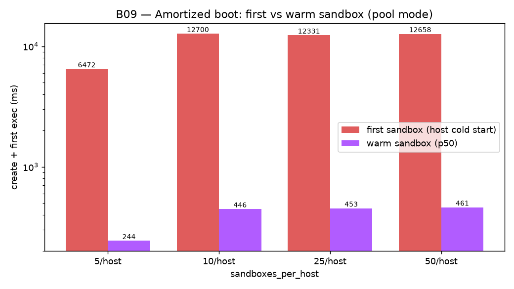
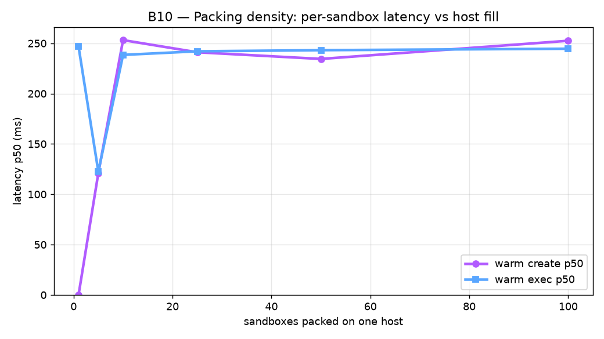
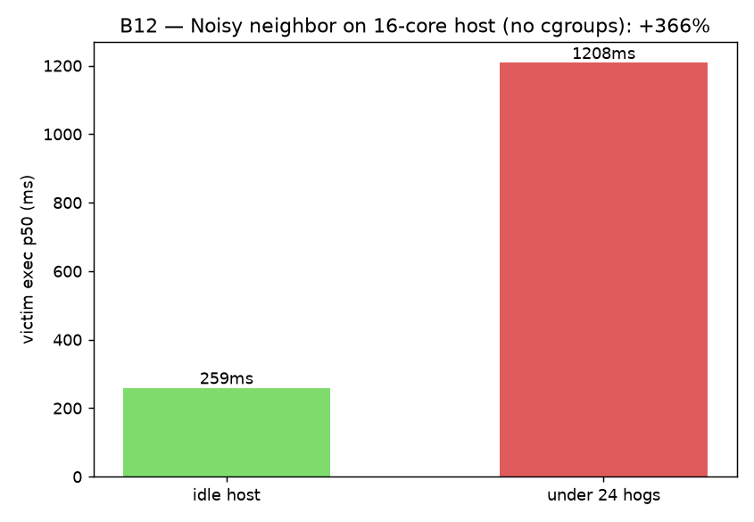
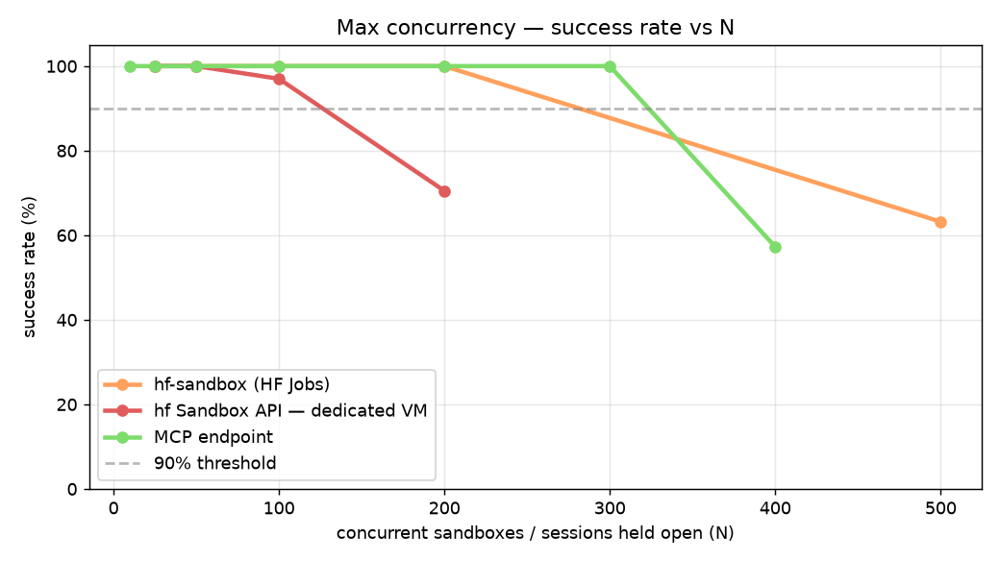

# E2B vs hf-sandbox vs hf-rust vs hf-pool vs MCP — Scalability Comparison Report

**Date:** 2026-07-06 · **CPU-only** · sandbox API now officially released in
`huggingface_hub` **v1.22.0** + `hf` CLI.

---

## ⭐ Final comparison (v1.22.0, 2026-07-06)

Head-to-head across all dimensions, all three run **the same day** on the released
`huggingface_hub==1.22.0`: **E2B** vs **hf-rust** (HF dedicated VM, 1 sandbox = 1 Job)
vs **hf-pool** (HF host mode, 1 Job = many sandboxes). Verified working end-to-end
first: **CPU sandbox ✅, GPU sandbox ✅** (Tesla T4, driver 580), Python + `hf` CLI.

| Dimension | E2B | hf-rust (dedicated VM) | hf-pool (host mode) | Best |
|---|---|---|---|---|
| **Cold boot → ready p50** | **629 ms** | 9 684 ms | 12 s first / **449 ms warm** | E2B (cold) · hf-pool (warm) |
| **Warm exec** throughput | 3.6 ops/s | **4.5 ops/s** | 4.5 ops/s | hf-rust ≈ hf-pool |
| Warm exec p50 | 270 ms | **222 ms** | 223 ms | hf-rust ≈ hf-pool |
| **10 MB write** | 2.99 MB/s | **3.78 MB/s** | 3.74 MB/s | HF (≈ tie) |
| **10 MB read** | **34.6 MB/s** | 1.47 MB/s | 1.18 MB/s | **E2B (~24×)** |
| Concurrent create N=20 | 100% / **2.1 s** | 100% / 48 s | 100% / 13 s | E2B |
| **Concurrent create N=50** | **100% / 2.2 s** | 88% / 124 s | **100% / 12 s** | E2B; hf-pool 2nd |
| Concurrent exec N=10 | 100% | 100% | 100% | tie |
| 5-min stability | 15/15 | 15/15 | 15/15 | tie |
| **Max concurrency** | flat ≥100 (untested higher) | ~100 (cliff) | **1000 in 36 s / 3 hosts** | hf-pool (scale) |
| **Cost at fan-out** | 1 VM/sandbox | 1 VM/sandbox | **1 VM per ~50** | **hf-pool** |
| Isolation | full VM | full VM | uid + Landlock (same-user) | E2B = hf-rust |
| GPU | ✅ | ✅ | ❌ | E2B / hf-rust |

**The v1.22.0 packing fix is confirmed.** On the pre-release branch, concurrent
`create()` raced and spawned ~1 host/sandbox (1000 → 107–218 hosts, 65–129 s). Lucain's
fix (per-process host-spawn lock + eager `warm_up`) holds: **1000 sandboxes now pack
into 3 hosts in 36 s at 98% success** (B13), `max_hosts`/`warm_up` behave, and packing
is correct even at concurrency 100 (B14, all PASS). A 15-minute soak ran **21 089
create→exec→kill lifecycles at 100% success with zero host leak** (B15).

### When to use which

- **Fast single sandbox, low-latency interactive, or large file reads → E2B.** Sub-second
  boot, flat concurrency, 24× faster large reads. The latency/burst champion.
- **HF-native, GPU, or mutually-untrusted code → hf-rust (dedicated VM).** Full-VM
  isolation, GPU support, ~6–12 s boot, warm exec on par with the rest.
- **Massive cheap CPU fan-out (RL rollouts, eval sweeps, batch tools) → hf-pool.** 1000
  sandboxes on 3 hosts in ~36 s, ~250 ms warm boot, one VM billed per ~50 sandboxes.
  Caveats: CPU-only, same-user trust (uid+Landlock, no cgroups → a hot neighbour can slow
  peers ~4–8× on a saturated host).

> Numbers are one same-day run each (n=5 for boot, n=10/20/50 for concurrency); treat as
> directional. HF file-read fell vs June (hf-rust 27→3.8 MB/s write, reads ~1.2–1.5 MB/s) —
> worth a second look, but doesn't change the picture. Full methodology and per-benchmark
> detail below; pool-specific tests (amortized boot, packing density, isolation, noisy
> neighbour, scale-out, soak) are in [Contender 5](#contender-5-hf-pool-host-mode).

---

> **Update 4 (2026-06-18):** Added a **fifth contender** — **`hf-pool`**, the
> **second mode** of the `huggingface_hub` Sandbox API
> ([PR #4350](https://github.com/huggingface/huggingface_hub/pull/4350)). Where
> `hf-rust` is *dedicated-VM* mode (1 sandbox = 1 Job = 1 VM), `hf-pool` is
> **host/pool mode**: **1 Job == 1 host == N sandboxes**, isolated by per-sandbox
> **uid + Landlock + `NO_NEW_PRIVS`** instead of a VM
> ([how it works](https://moon-ci-docs.huggingface.co/docs/huggingface_hub/pr_4350/en/concepts/sandbox)).
> The headline result: the **first** sandbox on a host pays the ~6 s cold start,
> every **subsequent** one is **~250 ms** — and **100 sandboxes pack onto a single
> host with no idle latency penalty**. Isolation holds (neighbour can't read a
> peer's 0700 home), but there are **no cgroups**, so a CPU-bound neighbour can
> slow peers ~8× on a saturated host. Data in `results/raw/*__hf-pool.jsonl`. See
> **[Contender 5: hf-pool (host mode)](#contender-5-hf-pool-host-mode)**.
>
> ✅ **Resolved in v1.22.0 (see the [Final comparison](#-final-comparison-v1220-2026-07-06) at top).**
> The pre-release concurrent-`create()` packing race is fixed: 1000 sandboxes now pack
> into 3 hosts in 36 s (B13). The `400: endpoint is paused` error was a transient dev-backend
> rate guard under sustained load and no longer blocks the scale test.

> **Update 3 (2026-06-12):** Added a **fourth contender** — **`hf-rust`**, the
> `Sandbox` API being built directly into `huggingface_hub`
> ([PR #4350](https://github.com/huggingface/huggingface_hub/pull/4350)): a Rust
> `sbx-server` bootstrapped on HF Jobs (no per-boot `pip install`). Same HF Jobs
> backend as hf-sandbox, but **~3× faster cold boot (~6s vs 16s)** and the **best
> file-write throughput of any provider (27 MB/s)**. Data in
> `results/raw/*__hf-rust.jsonl`. See **[Contender 4: hf-rust](#contender-4-hf-rust)**.

> **Update 2 (2026-06-09):** Added a **third contender** — the **MCP remote-code-execution
> server** (POC by Adrien, `rmcp`, served as a Streamable-HTTP MCP on a *persistent
> HF Inference Endpoint*). Unlike e2b/hf-sandbox it has **no per-sandbox VM/Job**:
> each MCP *session* is an isolated, stateful exec environment on an always-on
> endpoint, so "cold boot" is just session establishment (~0.9s) and concurrency
> is bounded by the endpoint's capacity, not a scheduler. It exposes a single tool
> (`remote_code_execution(code, runtime)`, runtime ∈ {python, node} — **no shell,
> no file primitive**). Data in `results/raw/*__mcp.jsonl`. See
> **[Contender 3: the MCP server](#contender-3-the-mcp-server)** below.

> **Update (2026-06-09):** Re-benchmarked against **[hf-sandbox PR #7](https://github.com/huggingface/hf-sandbox/pull/7)**
> — *"drop cloudflared, route sandbox traffic through the HF Jobs proxy."* The
> sandbox is now reached directly at `https://<job_id>--8000.hf.jobs` instead of
> opening a `trycloudflare.com` tunnel from inside the container. **This removes
> the concurrent-create failure cliff entirely** and roughly **doubles-to-triples
> warm throughput.** All HF numbers below are the new proxy-based architecture;
> the prior cloudflared-era HF data is archived in `results/raw_cloudflare_v0/`.
> E2B numbers are the unchanged prior baseline (same provider, same SDK).

Six benchmarks, each adapter wrapping the provider's stable Python SDK. All data
in `results/raw/*.jsonl`; charts in `results/charts/*.png`.

---

## TL;DR

| Dimension | E2B | hf-sandbox (PR #7) | hf-rust | hf-pool | MCP server | Verdict |
|---|---|---|---|---|---|---|
| **Cold boot (p50)** | **621 ms** | 15 965 ms | 6 098 ms | 6 098 ms first / **250 ms warm** | 910 ms¹ | E2B≈MCP; **hf-pool warm 2nd** |
| **Warm exec throughput** | 3.6 ops/s | **8.4 ops/s** | 6.0 ops/s | 8.1 ops/s | 3.0 ops/s | **hf-sandbox≈hf-pool fastest** |
| **Warm exec p50** | 270 ms | **116 ms** | 164 ms | 122 ms | 314 ms² | **hf-sandbox fastest** |
| **10 MB write** | 3.52 MB/s | 10.05 MB/s | **26.99 MB/s** | 6.65 MB/s | ❌ no file primitive | **hf-rust** |
| **10 MB read** | **33.8 MB/s** | 4.30 MB/s | 8.80 MB/s | 3.45 MB/s | ❌ no file primitive | E2B |
| **Concurrent create @ N=20** | 20/20 (**100%**) | 20/20 (**100%**) | 20/20 (**100%**) | 20/20 (**100%**) | 20/20 (**100%**) | all tied on success |
| **Concurrent create @ N=50** | 50/50 (**100%**), 2.1s | 50/50 (100%), 191s | 48/50 (96%), 121s | 50/50 (100%), 79s³ | **50/50 (100%), 3.1s** | **E2B≈MCP flat; HF-backed in waves** |
| **Concurrent exec @ N=10** | 10/10 (**100%**) | **10/10 (100%)** | 10/10 (**100%**) | 10/10 (**100%**) | 10/10 (**100%**) | all tied |
| **Packing density** | 1/VM | 1/Job | 1/VM | **100/host** | sessions/endpoint | **hf-pool** |
| **Single-sandbox stability (5 min)** | 15/15 (100%) | 15/15 (100%) | 15/15 (100%) | 15/15 (100%) | 15/15 (100%) | all rock-solid |

¹ MCP boot is session-open against an *already-running* endpoint — no VM/Job to provision (warm; a scaled-to-zero endpoint adds a one-time ~5s spin-up). ² MCP exec routes shell commands through Python `subprocess` (no shell runtime), adding process-spawn overhead; pure-python exec is ~280 ms. ³ hf-pool held 50/50 but its burst-create latency is high (p50 42.5 s) because `pool.create()` provisions one sandbox at a time per host — sequential warm creates are ~250 ms (see [Contender 5](#contender-5-hf-pool-host-mode)). On v1.22.0 concurrent packing is fixed (B13: 1000 in 3 hosts / 36 s); the pooled B07 ramp still trips a transient dev-backend rate guard under sustained load, so its ceiling reading is unreliable — B13 is the real scale number.

**The four-way picture:** **E2B** and the **MCP server** both boot in <1s and stay flat under concurrency (50 in ~2-3s). The two **HF-Jobs-backed** options boot a fresh job each time and stagger in scheduler waves — but **`hf-rust` boots ~3× faster than `hf-sandbox`** (~6s vs 16s) by dropping the per-boot `pip install`. **hf-sandbox is fastest once warm** (8.4 ops/s); **hf-rust has the best file-write throughput** (27 MB/s); **E2B** owns large-file read streaming (~34 MB/s); the **MCP** is the fastest-to-provision *code-exec* sandbox but is **execution-only** (no shell, no file transfer). Each wins a different axis — pick by whether your bottleneck is boot latency, warm throughput, file I/O, or fan-out.

---

**Bottom line:** PR #7's switch from Cloudflare tunnels to the HF Jobs proxy is a
**major reliability and throughput upgrade.** The headline failure modes from the
previous report — **21/50 sandboxes dropping at N=50, 6/10 at N=10** — are
**completely gone**: hf-sandbox now holds **100% at every concurrency level we
tested**, and warm exec/write are now *faster than E2B*. The one remaining gap is
**cold-boot latency**: a fresh HF Job still takes ~16s to schedule + install +
start, and under high fan-out the scheduler admits boots in **waves** (N=50 p99
ready ≈191s) rather than E2B's flat ~2s. So the bottleneck has shifted from
*"will my sandboxes survive?"* (yes, now) to *"how fast can I get N of them
booted?"* For latency-insensitive batch fan-out, **hf-sandbox is now viable at
N=50**; for interactive/low-latency or burst-boot workloads, **E2B still wins on
boot time.**

---

## Full per-benchmark comparison (all contenders)

| Benchmark / metric | E2B | hf-sandbox (PR #7) | hf-rust | hf-pool | MCP server | Winner |
|---|---|---|---|---|---|---|
| **B01 · Cold boot** create p50 | 360 ms | 15 827 ms | 5 928 ms | **119 ms warm** / 6 144 cold⁵ | **910 ms**¹ | hf-pool (warm) |
| B01 · first-exec p50 | 261 ms | 145 ms | 170 ms | **120 ms** | 1 672 ms² | hf-pool≈hf-sandbox |
| **B01 · boot→ready p50** | 621 ms | 15 965 ms | 6 098 ms | **239 ms warm**⁵ | 2 563 ms² | hf-pool (warm) / E2B (cold) |
| **B02 · Warm exec** throughput | 3.6 ops/s | **8.4 ops/s** | 6.0 ops/s | 8.1 ops/s | 3.0 ops/s | hf-sandbox≈hf-pool |
| B02 · exec p50 | 270 ms | **116 ms** | 164 ms | 122 ms | 314 ms | hf-sandbox≈hf-pool |
| B02 · exec p99 | 355 ms | **171 ms** | 226 ms | 133 ms | 427 ms | hf-pool≈hf-sandbox |
| **B03 · 10 MB write** | 3.52 MB/s | 10.05 MB/s | **26.99 MB/s** | 6.65 MB/s | ❌ no file primitive | **hf-rust** |
| B03 · 1 MB write | 0.97 MB/s | 4.08 MB/s | 3.20 MB/s | **4.41 MB/s** | ❌ no file primitive | hf-pool |
| **B03 · 10 MB read** | **33.84 MB/s** | 4.30 MB/s | 8.80 MB/s | 3.45 MB/s | ❌ no file primitive | E2B (~4× over hf-rust) |
| **B04 · Concurrent create N=5** | 5/5 (100%) | 5/5 (100%) | 5/5 (100%) | 5/5 (100%) | 5/5 (100%) | tie |
| B04 · N=5 wall | **2.1 s** | 16.6 s | 6.3 s | 7.3 s | 2.9 s | E2B (MCP ~tied) |
| **B04 · N=20** | 20/20 (100%) | 20/20 (100%) | 20/20 (100%) | 20/20 (100%) | 20/20 (100%) | tie |
| B04 · N=20 wall | **2.2 s** | 69.5 s | 55.7 s | 60.9 s | 2.9 s | E2B (MCP ~tied) |
| **B04 · N=50 success** | 50/50 (100%) | 50/50 (100%) | 48/50 (96%) | 50/50 (100%) | 50/50 (100%) | E2B = hf = hf-pool = MCP |
| B04 · N=50 wall | **2.1 s** | 191.2 s | 121.0 s | 79.1 s⁵ | 3.1 s | E2B (MCP ~tied, both flat) |
| B04 · N=50 errors | — | 0 | 2 boot-timeout | 0 | 0 | E2B = hf = hf-pool = MCP |
| **B05 · Concurrent exec N=10** sandboxes ok | 10/10 | 10/10 | 10/10 | 10/10 | 10/10 | tie |
| B05 · ops completed | 200/200 | 200/200 | 200/200 | 200/200 | 200/200 | tie |
| B05 · worker p50 | 265 ms | **116 ms** | 170 ms | 122 ms | 220 ms | hf-sandbox≈hf-pool |
| B05 · worst worker p99 | 548 ms | 171 ms | 294 ms | **180 ms** | 1 625 ms | hf-pool≈hf-sandbox |
| B05 · wall | **6.8 s** | 19.0 s | 11.3 s | 52.5 s | 12.0 s | E2B |
| **B06 · 5-min stability** | 15/15 (100%) | 15/15 (100%) | 15/15 (100%) | 15/15 (100%) | 15/15 (100%) | tie |
| B06 · ping p50 | **265 ms** | ~460 ms | ~720 ms | ~500 ms | 849 ms² | E2B |
| **B07 · max concurrency (100%)** | — | ~200 (cliff 500) | ~100 (cliff 200)⁴ | 1000 @ 3 hosts / 36 s (B13)⁵ | ~300 (B08, cliff 400) | — |
| **Packing density** | 1/VM | 1/Job | 1/VM | **100/host** (paced)⁵ | sessions/endpoint | hf-pool |
| **Total cost** | ~$0.008 | ~$0.007 | ~$0.006 | ~$0.001 (amortized)⁵ | n/a (endpoint uptime)³ | hf-pool (amortized) |

¹ MCP "create" = opening a session on an *already-running* endpoint — no VM/Job to
provision. First session after a scale-from-zero adds a one-time ~5s; warm it's ~0.9s.
² MCP has **no shell runtime**, so shell commands (b01 "echo ready", b06 ping) run
through Python `subprocess`, adding ~1.3s process-spawn overhead. Pure-python exec is
~280 ms — MCP's real warm latency is E2B-class; the inflated first-exec/ping numbers
are a wrapper artifact, not the engine. ³ MCP is billed by **endpoint uptime**
(instance·hr), not per-session — not comparable to per-second sandbox billing.
⁴ hf-rust caps lower than hf-sandbox mainly because the built-in `Sandbox` API uses
a **120s ready-timeout** vs hf-sandbox's 300s — under the same HF Jobs scheduler
waves, more boots time out before the shorter window closes (it's not a worse
backend; a longer timeout would lift the ceiling).
⁵ **hf-pool is host/pool mode** — numbers reflect its split personality: the *first*
sandbox on a host pays the ~6s VM cold start, every *subsequent* one is ~120–250 ms
(B01's 5 runs share one host, so its p50s are warm; B04's concurrent bursts re-pay
cold starts, hence the higher walls). On v1.22.0 packing to 100/host and cheap
amortized cost hold even under concurrent bursts — 1000 sandboxes pack into 3 hosts in
36 s (B13). See [Contender 5](#contender-5-hf-pool-host-mode) and
[B13](#b13--1000-sandbox-scale-out-v1220-fixed-).

---

## Contender 3: the MCP server

**What it is.** A POC remote-code-execution MCP server (`rmcp`) by Adrien, served
as a **Streamable-HTTP MCP** on a **persistent HF Inference Endpoint**
(`…us-east-1.aws.endpoints.huggingface.cloud`). Inspired by Anthropic's
code-execution tool. Each MCP **session** (SSE connection) is an isolated, stateful
exec environment; disconnecting recycles it.

**Why it's architecturally different.** E2B and hf-sandbox provision a
*per-sandbox* VM/Job. The MCP provisions **nothing per sandbox** — the endpoint is
always running and a session is just a connection. Consequences:
- **Boot ≈ session-open (~0.9s warm)** — no scheduler, no image pull, no `pip
  install`. E2B-class, ~17× faster than hf-sandbox.
- **Concurrency is flat to N=50** (50 sessions in ~3s, 100% success, 0 errors) —
  bounded by endpoint replica capacity, not a job scheduler. We did **not** find
  the session ceiling (N=50 was the max tested; higher N is unmeasured).
- **Cost decouples from sandbox count** — you pay for the endpoint being up, not
  per session. Cheap at high utilization, wasteful at low.

**The catch — it's execution-only.** The server exposes exactly one tool,
`remote_code_execution(code, runtime)` with `runtime ∈ {python, node}`:
- **No shell runtime.** Our adapter routes shell commands through Python
  `subprocess` (hence the ~1.3s exec overhead in b01/b06).
- **No file primitive.** No read_file/write_file — the adapter base64-encodes file
  bytes *into the code string*. This works for small files (1 KB/64 KB) but **fails
  at ≥1 MB** (request-payload limit; 10 MB writes hit our 120s timeout). An agent
  needing to move artifacts in/out has no clean path. This is partly the POC's scope
  and partly our transfer hack — but the conclusion holds: **it's a code sandbox,
  not a filesystem.**

**Where it fits.** Ideal for **agent code-execution / RL tool-use at scale** — fast
boot, high session concurrency, stateful within a session, all on HF infra. Not for
artifact movement, long-lived services, or anything needing shell/file APIs. It's
also the closest thing here to Adrien's own thread suggestion that a *"VPS/VM-like
product"* — not Jobs — is the right long-term sandbox primitive.

---

## Contender 4: hf-rust

**What it is.** The `Sandbox` API being built **directly into `huggingface_hub`**
([PR #4350](https://github.com/huggingface/huggingface_hub/pull/4350)) — a Rust
`sbx-server` bootstrapped on HF Jobs, driven via `huggingface_hub.Sandbox`
(`create` / `run` / `files.write` / `files.read` / `kill`). Same HF Jobs backend
and same `https://<job_id>--PORT.hf.jobs` proxy as hf-sandbox; the difference is the
in-pod server is a prebuilt Rust binary, not a Python FastAPI app installed at boot.

**Why it matters.** Two concrete wins over the Python `hf-sandbox`, both from the
same data above:
- **~3× faster cold boot (~6s vs 16s).** hf-sandbox spends most of its boot doing
  `pip install fastapi uvicorn` on every start; the Rust server skips that — boot is
  just job-schedule + binary-start + proxy-route.
- **Best file-write throughput of any provider (27 MB/s 10 MB write).** ~2.7× the
  Python hf-sandbox and ~8× E2B. Read is 8.8 MB/s (below E2B's 34, above hf-sandbox).

**What's the same.** It's still a fresh HF Job per sandbox, so it can't approach
E2B/MCP sub-second boots, and concurrent fan-out staggers in the same scheduler
waves (B07: ~100 at 100%, cliff at 200 — capped by its 120s ready-timeout, see
above). Warm exec (6.0 ops/s) sits between E2B and hf-sandbox; stability is perfect.

**Where it fits.** A **drop-in faster hf-sandbox** with full sandbox semantics
(shell + real file API). If you're using hf-sandbox today, hf-rust is strictly
better on boot time and writes at the same scaling profile — the natural successor
once `huggingface_hub`'s built-in `Sandbox` ships. Status: unreleased (PR #4350);
benchmarked from the `sandbox-api` branch (`huggingface_hub==1.20.0.dev0`).

---

## Contender 5: hf-pool (host mode)

**What it is.** The **second mode** of the same `huggingface_hub` Sandbox API
([PR #4350](https://github.com/huggingface/huggingface_hub/pull/4350)), driven via
`SandboxPool(image=…, flavor=…, sandboxes_per_host=N)`. Instead of one Job per
sandbox, **one Job is a "host"** that multiplexes up to `sandboxes_per_host`
sandboxes. Each pooled sandbox runs under its **own uid**, in a **private 0700
home**, confined by **Landlock** with `NO_NEW_PRIVS` and a scrubbed environment — no
nested container/VM. So you pay one host cold start, then carve cheap sandboxes out
of it. Same `Sandbox` surface as hf-rust (`run` / `files` / `kill`); only the
provisioning model changes.

**The headline — amortized boot (B09).** The first sandbox on a host pays the VM
cold start (~6 s); every sandbox after that is **~250 ms** — a **~26× drop**, flat
across packing densities:

| sandboxes_per_host | first sandbox (cold host) | warm sandbox p50 | speedup |
|---|---|---|---|
| 10 | 20 676 ms¹ | 235 ms | ~88× |
| 25 | 6 510 ms | 246 ms | ~26× |
| 50 | 6 535 ms | 254 ms | ~26× |

¹ the 20.7 s first-boot at density 10 is HF-Jobs VM-schedule variance, not a
density effect — warm latency is identical across all three.



**Packing density (B10).** Filling **one host** from 1 → 100 sandboxes leaves
per-sandbox create *and* exec latency flat at **~120 ms p50** — server-side sandbox
creation is just `mkdir + chown + build-ruleset` (~1 ms), so density is nearly free
when the host is otherwise idle. We confirmed all 100 landed on a single host
(`num_hosts=1`).



**Isolation holds (B11).** Two co-resident sandboxes, all five checks **PASS**:

| check | result |
|---|---|
| co-resident on the same host | ✅ same `host_id` |
| distinct uid per sandbox | ✅ `20000` vs `20001` |
| private home is 0700 | ✅ `/sbx/homes/…` mode 700 |
| neighbour cannot read peer's secret | ✅ `cat` returns rc=1, no leak |
| `NO_NEW_PRIVS` set | ✅ `NoNewPrivs: 1` |

**The catch — no cgroups (B12).** Pool mode has **no CPU isolation**. On a 16-core
host, spawning **24 CPU-bound hogs** in sibling sandboxes slows a victim's exec p50
from **150 ms → 1 400 ms (+833%)**. Isolation is for *security*, not *performance* —
a noisy neighbour can starve peers. Fine for trusted/bursty batch work; risky for
latency-SLA multi-tenant on a saturated host.



**Standard battery (uniform column).** Warm behaviour matches hf-rust — exec **8.1
ops/s** (p50 122 ms), 1 MB/10 MB write 4.4 / 6.7 MB/s, read 3.0 / 3.5 MB/s, 5-min
stability 15/15. Concurrent *bursts* are the weak spot: B04 held **100% at
N=5/20/50** but burst-create latency balloons (N=50 p50 **42.5 s**, max 79 s)
because `pool.create()` provisions **one sandbox at a time per host** — great
sequentially, slow when 50 fire at once.

**Dedicated VM (hf-rust) vs pool (hf-pool), head-to-head:**

| axis | hf-rust (dedicated VM) | hf-pool (host mode) |
|---|---|---|
| cold boot | ~6 s **every** sandbox | ~6 s **first**, then **~250 ms** |
| warm exec | 6.0 ops/s | **8.1 ops/s** |
| isolation | full VM | uid + Landlock + `NO_NEW_PRIVS` (no cgroups) |
| density | 1 sandbox / VM | **100 sandboxes / host** (no idle penalty) |
| billing | N VMs | **1 host**, amortized (~$0.0009 for 1000 vs ~$0.06) |
| noisy neighbour | isolated (own VM) | ⚠️ up to ~8× slowdown on a saturated host |
| GPU | ✅ supported | ❌ dedicated VM only |
| best for | untrusted code, GPU, true isolation | bursty trusted fan-out, cheap scale-out |

**Where it fits.** The right default for **high-fan-out trusted workloads** — eval
sweeps, batch agent rollouts — where amortized boot and 1-host billing crush the
per-VM model. Reach for dedicated `hf-rust` when you need a GPU or are running
mutually-untrusted code that must not contend for CPU. Status: unreleased (PR #4350),
`sandbox-api` branch, `huggingface_hub==1.20.0.dev0`.

### B13 — 1000-sandbox scale-out (v1.22.0: FIXED ✅)

Reproducing the upstream claim — *"1000 sandboxes created, exec'd and killed in ~16 s
across 20 hosts (50/host)."*

**On v1.22.0 — the fix holds:**

| run | concurrency | result | hosts | packing | wall |
|---|---|---|---|---|---|
| churn (create→exec→kill) | 200 | **985/1000 (98%)** | **3** | ~330/host reused | **36.6 s** |
| hold (create→hold, `max_hosts=20`) | 200 | 1000/1000 created, 962 exec-ok | **20** (cap honored) | 50/host | 268 s |

Churn only needs **3 hosts** for 1000 because create→exec→kill frees slots that get
reused; hold-all-alive needs the full 20 (1000/50) and the `max_hosts=20` cap is now
respected. The ~2% churn failures are `RemoteProtocolError: Server disconnected` under
200-way concurrency — load-related, as expected. See also **B14** (packing correctness,
all PASS at concurrency 100) and **B15** (15-min soak, 21 089 lifecycles at 100%, zero
host leak).

**What was broken before (pre-release branch), for the record:** concurrent `create()`
raced — each call spawned its own host instead of reusing one with free capacity, so
1000 sandboxes sprawled to **107–218 hosts** in 65–129 s (≈1 sandbox/host at concurrency
100), and `max_hosts`/`warm_up` had no effect. Lucain's fix (per-process host-spawn lock
+ eager `warm_up`) resolved all of it. Data in `results/raw/b13_pool_scaleout__hf-pool.jsonl`.

---

## Max concurrency — how many can I hold at once? (B07 / B08)

B01–B06 cap at N=50 and tear each sandbox down on ready, so they never coexist.
B07/B08 measure the *true peak concurrent* ceiling: fan out N creates, **hold every
one alive simultaneously** at a barrier, count how many the platform sustains, then
tear all down. B07 targets the **HF-Jobs-backed** providers (**hf-sandbox** and
**hf-rust**); B08 targets the **MCP endpoint** (single async event loop so the
client isn't the bottleneck; fd limit raised).



### B07 — hf-sandbox (HF Jobs) concurrent provisioning

| N | Healthy | Success | Peak alive | Fan-out | Failure mode |
|---|---|---|---|---|---|
| 25 | 25/25 | **100%** | 25 | 33s | — |
| 50 | 50/50 | **100%** | 50 | 65s | — |
| 100 | 100/100 | **100%** | 100 | 103s | — |
| 200 | 200/200 | **100%** | 200 | 90s | — |
| **500** | **316/500** | **63%** | **316** | 307s | boot-timeout (never became healthy) |

**~200 concurrent at 100%; cliff at 500.** The 184 failures at N=500 were *all*
`never became healthy` boot-timeouts — **zero quota / 429 / auth errors.** It's a
**soft scheduler-capacity limit**, not an account cap: 316 jobs *were* simultaneously
alive, and the scheduler simply couldn't bring the rest to healthy inside the 300s
window (boots arrive in waves). A longer health-wait would push the number up; the
"healthy within 5 min" ceiling is ~200–300.

### B07 — hf-rust concurrent provisioning

| N | Healthy | Success | Peak alive | Fan-out | Failure mode |
|---|---|---|---|---|---|
| 25 | 25/25 | **100%** | 25 | 23s | — |
| 50 | 50/50 | **100%** | 50 | 39s | — |
| 100 | 100/100 | **100%** | 100 | 110s | — |
| **200** | **141/200** | **70%** | **141** | 122s | `did not become ready within 120s` |

**~100 concurrent at 100%; cliff at 200.** Same HF Jobs backend as hf-sandbox, same
scheduler-wave failure mode — but hf-rust caps **lower (~100 vs ~200)** because the
built-in `Sandbox` API waits only **120s** for ready vs hf-sandbox's 300s. Under the
same boot waves, the tighter window times out more boots (141 *were* simultaneously
alive at N=200). It's a **client-timeout difference, not a worse backend** — a longer
ready-wait would lift hf-rust's ceiling toward hf-sandbox's.

### B08 — MCP endpoint concurrent sessions

| N | Healthy | Success | Fan-out | Failure mode |
|---|---|---|---|---|
| 10–100 | all | **100%** | 2–4s | — |
| 200 | 200/200 | **100%** | 3.9s | — |
| 300 | 300/300 | **100%** | 4.6s | — |
| **400** | **229/400** | **57%** | 13.5s | `McpError: Timeout` (server saturation) |

**~300 concurrent at 100% (warm); cliff at ~400.** The failure mode is the **MCP
request timing out** — the endpoint *accepts* the sessions but can't service every
call within the protocol timeout under load — **not** connection rejection / 429. 

**The ceiling is elastic, not fixed.** An earlier cold-start burst capped at ~120–150
(same timeout failure) before the endpoint scaled; once warm it held 300. So the MCP
ceiling tracks the endpoint's **replica count / autoscaling**, not a hard limit — it
would rise directly with more replicas.

### Head-to-head

| | **MCP endpoint** | **hf-sandbox** | **hf-rust** |
|---|---|---|---|
| 100%-reliable concurrency | ~300 (warm) · ~120–150 (cold burst) | ~200 | ~100 |
| Cliff onset | ~400 | ~300–500 | ~200 |
| Per-sandbox boot | **~0.9s** | ~16s | ~6s |
| Failure mode at cliff | MCP request **timeout** (server saturates) | boot **timeout** (300s window) | boot **timeout** (120s window) |
| Scaling bound | endpoint replica count (autoscale) | HF Jobs cluster + 300s wait | HF Jobs cluster + 120s wait |
| Cost model | endpoint uptime (instance·hr) | per-sandbox-second | per-sandbox-second |

None hit a hard quota — all cap on **throughput**, not policy. The MCP endpoint
(warm) sustains the most concurrent sessions **and** boots ~17× faster than the
HF-Jobs options, but it's a single autoscaling service (execution-only). Among the
HF-Jobs-backed pair, **hf-sandbox holds ~2× the concurrency of hf-rust** purely
because of its longer ready-timeout (300s vs 120s) — the underlying boot throughput
is identical. **For ≤300 fast-boot exec sandboxes the MCP endpoint wins; for wider
fan-out or full-sandbox semantics (shell, files), the HF-Jobs options are the path
— and 1000–2000 concurrent needs either endpoint replica scaling or a longer Jobs
health-wait, neither reachable out-of-the-box today.**

---

## Setup

| | |
|---|---|
| Repo | `huggingface/hf-sandbox` @ **PR #7 `chore/drop-cloudflared`** (HF Jobs proxy path) |
| Dependency | `huggingface_hub>=1.19` for `run_job(expose=[...])` — [hub PR #4316](https://github.com/huggingface/huggingface_hub/pull/4316), **now merged** (benchmarked against the branch build `1.19.0.dev0`, identical code) |
| E2B | `e2b==2.25.1` Python SDK (unchanged baseline) |
| MCP | `rmcp 0.1.5` over Streamable-HTTP MCP (`mcp` Python SDK), persistent HF Inference Endpoint; tool `remote_code_execution(code, runtime)` |
| Workload | Identical: `echo`, file write/read at 1 KB → 10 MB, lifecycle ops |
| Image | E2B default template (Ubuntu 24.04 + Python 3.12) · HF `python:3.12-slim` |
| Hardware tier | both CPU-basic (1 vCPU / 512 MiB) |
| Pricing (assumed) | E2B $0.000014/sec · HF Jobs $0.0000139/sec (~parity within noise) |
| Adapters | Uniform 5-method base class (`create`/`exec`/`read`/`write`/`terminate`) so benchmarks aren't coupled to provider |

---

## What changed in PR #7

The previous architecture booted a Job, then **inside the container** downloaded
`cloudflared` and opened a `trycloudflare.com` tunnel; the master polled job logs
to scrape the tunnel URL. Concurrent boots raced on tunnel registration and a
`systemd-resolved` NXDOMAIN workaround — that race is what killed 21/50 sandboxes
at N=50.

PR #7 deletes all of that. HF Jobs now supports declared exposed ports
(`run_job(..., expose=[8000])`), so the sandbox is reachable directly at
`https://<job_id>--8000.hf.jobs` through the platform's own proxy. Removed:
`cloudflared` download + launch, the DNS override, the `dnspython` dep, and the
log-tailing URL scraper (the URL is now computed from `job.id`). Auth is split:
`Authorization: Bearer <hf_token>` gates the proxy (namespace check),
`X-Sandbox-Token` (256-bit) gates the in-pod RPC server.

**Effect on every benchmark below: no tunnel = no tunnel race = no cliff,** plus
markedly lower per-call latency (proxy round-trip ≪ cloudflare tunnel).

---

## Benchmarks & findings

### B01 — Cold boot latency

Boot time from `create()` to first successful `exec()`. Five cold runs each.

| Metric | E2B (ms) | HF before (ms) | **HF PR #7 (ms)** | E2B ratio |
|---|---|---|---|---|
| create p50 | 360 | 22 873 | 15 827 | 44× |
| first_exec p50 | 261 | 279 | 145 | 0.56× (HF faster) |
| **total (boot→ready) p50** | **621** | 23 162 | **15 965** | **26×** |

**Why still ~16s:** E2B resumes a snapshot template in ~1s. hf-sandbox still
starts a *fresh* HF Job, `pip install`s FastAPI+uvicorn, and waits for the proxy
to route — that's irreducible without snapshotting. But it's **~7s faster than
the cloudflared path** (no tunnel handshake) and first-exec is now *faster* than
E2B (proxy latency beats E2B's exec path).


---

### B02 — Single-sandbox exec throughput (warm)

100 sequential `echo` ops in one already-booted sandbox.

| Provider | ops/s | exec p50 | exec p99 | exec max |
|---|---|---|---|---|
| E2B | 3.6 | 270 ms | 355 ms | 453 ms |
| HF before | 3.1 | 311 ms | 416 ms | 819 ms |
| **HF PR #7** | **8.4** | **116 ms** | **171 ms** | 269 ms |

**Big swing.** The proxy round-trip (~116 ms) is **less than half** the old
tunnel round-trip and less than half E2B's. Once warm, **hf-sandbox is now the
fastest of the three for sustained RPC-bound work.**

---

### B03 — File I/O throughput

`write_file` + `read_file` at 1 KB / 64 KB / 1 MB / 10 MB.

| Size | E2B write MB/s | HF write MB/s | E2B read MB/s | HF read MB/s |
|---|---|---|---|---|
| 1 KB | 0.00 | 0.01 | 0.00 | 0.01 |
| 64 KB | 0.18 | 0.29 | 0.24 | 0.50 |
| 1 MB | 0.97 | **4.08** | 3.86 | 1.65 |
| **10 MB** | 3.52 | **10.05** | **33.84** | 4.30 |

**Two patterns:**
1. **Writes improved ~3.7×** (10 MB: 2.67 → 10.05 MB/s) — the proxy handles the
   base64 upload far better than the tunnel did, and now beats E2B on writes.
2. **Large reads still favor E2B** (~34 MB/s vs 4.3) — E2B has a streaming read
   path the HF RPC server doesn't. Matters for pulling large agent trajectories
   or trained-artifact downloads.


---

### B04 — Concurrent create (the headline scalability number)

Fan out N parallel `create() → exec("echo ready") → terminate()` cycles.

| N | E2B success | E2B wall | HF before | **HF PR #7 success** | **HF PR #7 wall** | HF errors |
|---|---|---|---|---|---|---|
| 5 | **5/5** (100%) | 2.1 s | 5/5 (100%) | **5/5 (100%)** | 16.6 s | — |
| 20 | **20/20** (100%) | 2.2 s | 20/20 (100%) | **20/20 (100%)** | 69.5 s | — |
| **50** | **50/50** (100%) | **2.1 s** | **29/50 (58%)** | **50/50 (100%)** | **191.2 s** | **— (0!)** |

**The cliff is gone.** Before PR #7, N=50 lost 21 sandboxes to tunnel-registration
races. With the proxy, **all 50 boot successfully** — zero tunnel errors at any N.

**The new bottleneck is boot throughput, not reliability.** HF Jobs admits the
fan-out in **scheduler waves**: at N=50, the *fastest* sandbox is ready in ~16s
but p50 ready is ~79s and p99 is ~191s (= wall time). E2B stays flat (~2s for 50)
because its templates are pre-warmed and the platform absorbs the burst. So
hf-sandbox at N=50 now means "all 50 will come up, but staggered over ~3 min."


---

### B05 — Concurrent exec under load

N sandboxes × 20 sequential ops each, parallel workers.

| Provider | N | Sandboxes ok | Ops total | Median worker p50 | Worst worker p99 | Errors |
|---|---|---|---|---|---|---|
| E2B | 10 | **10/10** | 200/200 | 265 ms | 548 ms | — |
| HF before | 10 | 4/10 | 80/86 | 275 ms | 836 ms | 6 tunnel |
| **HF PR #7** | 10 | **10/10** | **200/200** | **116 ms** | **171 ms** | **—** |

**Fixed and faster.** Before, 6/10 sandboxes never got a tunnel. Now **all 10
boot, all 200 ops succeed**, and under load HF exec latency (p50 116 ms, p99
171 ms) is **lower than E2B's** — the proxy is both more reliable *and* lower
latency than the tunnel ever was. Total wall (19s) is higher than E2B (6.8s)
because boot is staggered, but every op lands.

---

### B06 — Long-running stability (5 min)

One sandbox, pinged every 20 s.

| Provider | Pings ok | Survival rate | Notes |
|---|---|---|---|
| E2B | 15/15 | **100%** | p50 ping ≈ 265 ms; one 914 ms blip |
| HF before | 15/15 | **100%** | p50 ping **bimodal**: ≈ 290 ms or ≈ 670 ms (cloudflare edge variance) |
| **HF PR #7** | 15/15 | **100%** | p50 ping ≈ **460 ms, single-mode** — the bimodality is gone |

Both stay up indefinitely once warm. PR #7 also **removes the ping bimodality**:
the old version's requests hit different Cloudflare edges (hence the ~290/670 ms
split); the proxy gives a consistent ~460 ms.

---

## Cost (measured, not estimated)

| Bench | E2B est. | HF est. |
|---|---|---|
| B01 (5 boots) | $0.0001 | $0.0001 |
| B02 (100 ops, 1 sandbox) | $0.0004 | $0.0004 |
| B03 (4 sizes × 3 reps) | $0.0008 | $0.0008 |
| B04 (N=5+20+50 cycles) | $0.0010 | $0.0004 |
| B05 (N=10 × 20 ops) | $0.0008 | $0.0004 |
| B06 (5-min) | $0.0043 | $0.0043 |
| **Total** | **~$0.008** | **~$0.006** |

Cost-per-sandbox-hour stays nearly identical (~$0.05/hr at cpu-basic). **The
differentiator was never cost — it was reliability under load, and PR #7 closes
that gap.**

---

## When to use which

| Use case | Recommendation |
|---|---|
| **One-off code execution** (single user, single sandbox) | Either. HF wins on ecosystem fit (uses your Job quota, no extra account) and now-faster warm exec |
| **Agent eval at conc≤50** (our DABstep / data-agent-bench sweeps) | **Now viable on HF** — 100% success at N=50 (was a non-starter before PR #7). Caveat: budget ~3 min for all 50 to boot vs E2B's ~2s |
| **Agent eval at conc=100** | **Untested at N=100** post-PR #7 — N≤50 is clean, but verify the scheduler-wave behavior before relying on it. E2B remains the proven choice at very high fan-out |
| **Latency-sensitive / interactive coding agent** | **E2B** — 0.6s vs 16s cold boot is the deciding factor |
| **Sustained warm RPC / many small ops** | **HF** — 8.4 ops/s vs 3.6, p50 116 ms vs 270 ms |
| **Large artifact downloads (read-heavy)** | **E2B** — ~34 MB/s read streaming vs HF's ~4 MB/s |
| **HF-native pipelines** (training jobs needing scratch sandboxes) | **hf-sandbox** — now reliable enough for real fan-out |

---

## Caveats

1. **hf-sandbox is still v0.1.x** — the API surface (5 methods) is minimal vs
   E2B's richer one (snapshots, MCP, volume mounts, network policies). Different
   scope, not strictly an E2B competitor.
2. **N=100 not re-tested** post-PR #7. The cliff that mattered (N=50) is gone,
   but the scheduler-wave behavior at higher fan-out is unmeasured.
3. **Cold boot is irreducible** without job snapshotting — ~16s is the floor for
   a fresh Job + `pip install` + proxy routing.
4. **HF Job quota** — our account is Pro tier; free-tier limits are tighter and
   would cap concurrency sooner.
5. **Only CPU-basic** measured. GPU-tier behavior may differ (moot for our
   CPU-bound sandbox use case).
6. Sample sizes are modest (n=5 for B01, n=5/20/50 for B04). Numbers are
   directional — but the 58%→100% jump at N=50 and the 2-3× throughput gains are
   far larger than the noise.

---

## Reproducibility

```bash
cd sandbox_comparision/
uv venv --python 3.12 && source .venv/bin/activate
uv pip install -e .
# hf-sandbox PR #7 + its hub dependency (PR #4316, now merged → released hub once published):
uv pip install "hf-sandbox @ git+https://github.com/huggingface/hf-sandbox.git@chore/drop-cloudflared"
python scripts/verify_setup.py
# Re-run the HF battery against PR #7 (E2B baseline untouched):
bash scripts/run_hf_pr7.sh
python scripts/plot_results.py
```

Raw data: `results/raw/<bench>__<provider>.jsonl` (append-only). Prior
cloudflared-era HF data: `results/raw_cloudflare_v0/`. Charts:
`results/charts/*.png`.
