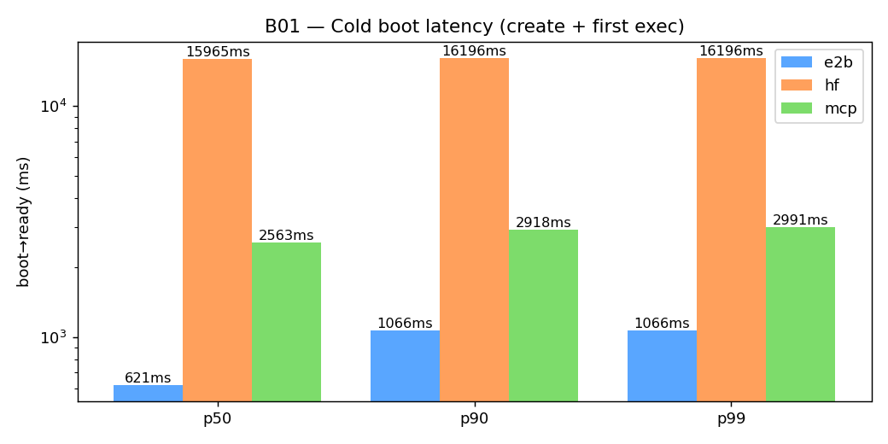
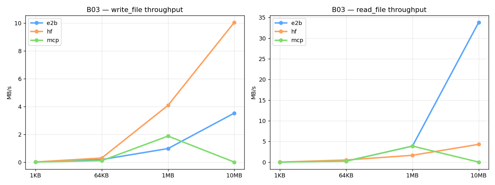
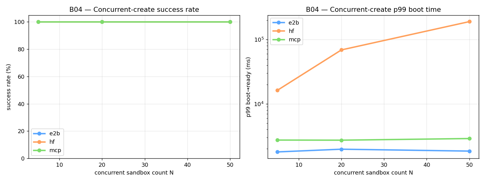

# hf-sandbox vs E2B vs MCP — Scalability Comparison Report

**Date:** 2026-06-09 · **CPU-only** · ~$0.02 total spend across all benchmarks.

> **Update 2 (2026-06-09):** Added a **third contender** — the **MCP remote-code-execution
> server** (POC by Adrien, `rmcp`, served as a Streamable-HTTP MCP on a *persistent
> HF Inference Endpoint*). Unlike e2b/hf-sandbox it has **no per-sandbox VM/Job**:
> each MCP *session* is an isolated, stateful exec environment on an always-on
> endpoint, so "cold boot" is just session establishment (~0.9s) and concurrency
> is bounded by the endpoint's capacity, not a scheduler. It exposes a single tool
> (`remote_code_execution(code, runtime)`, runtime ∈ {python, node} — **no shell,
> no file primitive**). Data in `results/raw/*__mcp.jsonl`. See
> **[Contender 3: the MCP server](#contender-3-the-mcp-server)** below.

> **Update (2026-06-09):** Re-benchmarked against **[hf-sandbox PR #7](https://github.com/huggingface/hf-sandbox/pull/7)**
> — *"drop cloudflared, route sandbox traffic through the HF Jobs proxy."* The
> sandbox is now reached directly at `https://<job_id>--8000.hf.jobs` instead of
> opening a `trycloudflare.com` tunnel from inside the container. **This removes
> the concurrent-create failure cliff entirely** and roughly **doubles-to-triples
> warm throughput.** All HF numbers below are the new proxy-based architecture;
> the prior cloudflared-era HF data is archived in `results/raw_cloudflare_v0/`.
> E2B numbers are the unchanged prior baseline (same provider, same SDK).

Six benchmarks, each adapter wrapping the provider's stable Python SDK. All data
in `results/raw/*.jsonl`; charts in `results/charts/*.png`.

---

## TL;DR

| Dimension | E2B | hf-sandbox (PR #7 proxy) | MCP server | Verdict |
|---|---|---|---|---|
| **Cold boot (p50)** | **621 ms** | 15 965 ms | **910 ms**¹ | E2B≈MCP ≫ HF (HF ~17-26× slower) |
| **Warm exec throughput** | 3.6 ops/s | **8.4 ops/s** | 3.0 ops/s | **HF fastest** |
| **Warm exec p50** | 270 ms | **116 ms** | 314 ms² | **HF fastest** |
| **10 MB write** | 3.52 MB/s | **10.05 MB/s** | ❌ no file primitive | HF |
| **10 MB read** | **33.8 MB/s** | 4.30 MB/s | ❌ no file primitive | E2B |
| **Concurrent create @ N=20** | 20/20 (**100%**) | 20/20 (**100%**) | 20/20 (**100%**) | all tied on success |
| **Concurrent create @ N=50** | 50/50 (**100%**), 2.1s | 50/50 (100%), 191s | **50/50 (100%), 3.1s** | **E2B≈MCP flat; HF in waves** |
| **Concurrent exec @ N=10** | 10/10 (**100%**) | **10/10 (100%)** | 10/10 (**100%**) | all tied |
| **Single-sandbox stability (5 min)** | 15/15 (100%) | 15/15 (100%) | 15/15 (100%) | all rock-solid |

¹ MCP boot is session-open against an *already-running* endpoint — no VM/Job to provision (and assumes the endpoint is warm; a scaled-to-zero endpoint adds a one-time ~5s spin-up). ² MCP exec routes shell commands through Python `subprocess` (no shell runtime), which adds process-spawn overhead; pure-python exec is ~280 ms.

**The three-way picture:** **E2B** and the **MCP server** both boot in <1s and stay flat under concurrency (50 in ~2-3s); **hf-sandbox** is now 100%-reliable at N=50 (PR #7 killed the tunnel cliff) but still boots in ~16s and staggers in scheduler waves. **hf-sandbox is fastest once warm** (8.4 ops/s, best 10 MB write). **E2B** owns large-file read streaming (~34 MB/s). The **MCP** is the fastest-to-provision *code-exec* sandbox but is **execution-only** — no shell, no file transfer — so it fits agent code-execution, not artifact movement. Each wins a different axis; pick by whether your bottleneck is boot latency, warm throughput, file I/O, or fan-out.

---

**Bottom line:** PR #7's switch from Cloudflare tunnels to the HF Jobs proxy is a
**major reliability and throughput upgrade.** The headline failure modes from the
previous report — **21/50 sandboxes dropping at N=50, 6/10 at N=10** — are
**completely gone**: hf-sandbox now holds **100% at every concurrency level we
tested**, and warm exec/write are now *faster than E2B*. The one remaining gap is
**cold-boot latency**: a fresh HF Job still takes ~16s to schedule + install +
start, and under high fan-out the scheduler admits boots in **waves** (N=50 p99
ready ≈191s) rather than E2B's flat ~2s. So the bottleneck has shifted from
*"will my sandboxes survive?"* (yes, now) to *"how fast can I get N of them
booted?"* For latency-insensitive batch fan-out, **hf-sandbox is now viable at
N=50**; for interactive/low-latency or burst-boot workloads, **E2B still wins on
boot time.**

---

## Full per-benchmark comparison (all contenders)

| Benchmark / metric | E2B | HF — before (cloudflared) | HF — after (PR #7 proxy) | MCP server | Winner |
|---|---|---|---|---|---|
| **B01 · Cold boot** create p50 | 360 ms | 22 873 ms | 15 827 ms | **910 ms**¹ | E2B (MCP close 2nd) |
| B01 · first-exec p50 | 261 ms | 279 ms | **145 ms** | 1 672 ms² | HF (PR #7) |
| **B01 · boot→ready p50** | **621 ms** | 23 162 ms | 15 965 ms | 2 563 ms² | E2B |
| **B02 · Warm exec** throughput | 3.6 ops/s | 3.1 ops/s | **8.4 ops/s** | 3.0 ops/s | HF (PR #7) |
| B02 · exec p50 | 270 ms | 311 ms | **116 ms** | 314 ms | HF (PR #7) |
| B02 · exec p99 | 355 ms | 416 ms | **171 ms** | 427 ms | HF (PR #7) |
| **B03 · 10 MB write** | 3.52 MB/s | 2.67 MB/s | **10.05 MB/s** | ❌ no file primitive | HF (PR #7) |
| B03 · 1 MB write | 0.97 MB/s | 1.01 MB/s | **4.08 MB/s** | ❌ no file primitive | HF (PR #7) |
| **B03 · 10 MB read** | **33.84 MB/s** | 4.79 MB/s | 4.30 MB/s | ❌ no file primitive | E2B (~8×) |
| **B04 · Concurrent create N=5** | 5/5 (100%) | 5/5 (100%) | 5/5 (100%) | 5/5 (100%) | tie |
| B04 · N=5 wall | **2.1 s** | 25.6 s | 16.6 s | 2.9 s | E2B (MCP ~tied) |
| **B04 · N=20** | 20/20 (100%) | 20/20 (100%) | 20/20 (100%) | 20/20 (100%) | tie |
| B04 · N=20 wall | **2.2 s** | 46.0 s | 69.5 s | 2.9 s | E2B (MCP ~tied) |
| **B04 · N=50 success** | 50/50 (100%) | 29/50 (58%) | 50/50 (100%) | 50/50 (100%) | E2B = HF = **MCP** |
| B04 · N=50 wall | **2.1 s** | 88.1 s | 191.2 s | 3.1 s | E2B (MCP ~tied, both flat) |
| B04 · N=50 errors | — | 21 tunnel | 0 | 0 | E2B = HF = MCP |
| **B05 · Concurrent exec N=10** sandboxes ok | 10/10 | 4/10 | 10/10 | 10/10 | E2B = HF = MCP |
| B05 · ops completed | 200/200 | 80/86 | 200/200 | 200/200 | tie |
| B05 · worker p50 | 265 ms | 275 ms | **116 ms** | 220 ms | HF (PR #7) |
| B05 · worst worker p99 | 548 ms | 836 ms | **171 ms** | 1 625 ms | HF (PR #7) |
| B05 · wall | **6.8 s** | — | 19.0 s | 12.0 s | E2B |
| **B06 · 5-min stability** | 15/15 (100%) | 15/15 (100%) | 15/15 (100%) | 15/15 (100%) | tie |
| B06 · ping p50 | **265 ms** | bimodal ≈290/670 ms | ~460 ms | 849 ms² | E2B |
| **Total cost** | ~$0.008 | ~$0.007 | ~$0.006 | n/a (endpoint uptime)³ | different model |

¹ MCP "create" = opening a session on an *already-running* endpoint — no VM/Job to
provision. First session after a scale-from-zero adds a one-time ~5s; warm it's ~0.9s.
² MCP has **no shell runtime**, so shell commands (b01 "echo ready", b06 ping) run
through Python `subprocess`, adding ~1.3s process-spawn overhead. Pure-python exec is
~280 ms — MCP's real warm latency is E2B-class; the inflated first-exec/ping numbers
are a wrapper artifact, not the engine. ³ MCP is billed by **endpoint uptime**
(instance·hr), not per-session — not comparable to per-second sandbox billing.

---

## Contender 3: the MCP server

**What it is.** A POC remote-code-execution MCP server (`rmcp`) by Adrien, served
as a **Streamable-HTTP MCP** on a **persistent HF Inference Endpoint**
(`…us-east-1.aws.endpoints.huggingface.cloud`). Inspired by Anthropic's
code-execution tool. Each MCP **session** (SSE connection) is an isolated, stateful
exec environment; disconnecting recycles it.

**Why it's architecturally different.** E2B and hf-sandbox provision a
*per-sandbox* VM/Job. The MCP provisions **nothing per sandbox** — the endpoint is
always running and a session is just a connection. Consequences:
- **Boot ≈ session-open (~0.9s warm)** — no scheduler, no image pull, no `pip
  install`. E2B-class, ~17× faster than hf-sandbox.
- **Concurrency is flat to N=50** (50 sessions in ~3s, 100% success, 0 errors) —
  bounded by endpoint replica capacity, not a job scheduler. We did **not** find
  the session ceiling (N=50 was the max tested; higher N is unmeasured).
- **Cost decouples from sandbox count** — you pay for the endpoint being up, not
  per session. Cheap at high utilization, wasteful at low.

**The catch — it's execution-only.** The server exposes exactly one tool,
`remote_code_execution(code, runtime)` with `runtime ∈ {python, node}`:
- **No shell runtime.** Our adapter routes shell commands through Python
  `subprocess` (hence the ~1.3s exec overhead in b01/b06).
- **No file primitive.** No read_file/write_file — the adapter base64-encodes file
  bytes *into the code string*. This works for small files (1 KB/64 KB) but **fails
  at ≥1 MB** (request-payload limit; 10 MB writes hit our 120s timeout). An agent
  needing to move artifacts in/out has no clean path. This is partly the POC's scope
  and partly our transfer hack — but the conclusion holds: **it's a code sandbox,
  not a filesystem.**

**Where it fits.** Ideal for **agent code-execution / RL tool-use at scale** — fast
boot, high session concurrency, stateful within a session, all on HF infra. Not for
artifact movement, long-lived services, or anything needing shell/file APIs. It's
also the closest thing here to Adrien's own thread suggestion that a *"VPS/VM-like
product"* — not Jobs — is the right long-term sandbox primitive.

---

## Setup

| | |
|---|---|
| Repo | `huggingface/hf-sandbox` @ **PR #7 `chore/drop-cloudflared`** (HF Jobs proxy path) |
| Dependency | `huggingface_hub>=1.19` for `run_job(expose=[...])` — [hub PR #4316](https://github.com/huggingface/huggingface_hub/pull/4316), **now merged** (benchmarked against the branch build `1.19.0.dev0`, identical code) |
| E2B | `e2b==2.25.1` Python SDK (unchanged baseline) |
| MCP | `rmcp 0.1.5` over Streamable-HTTP MCP (`mcp` Python SDK), persistent HF Inference Endpoint; tool `remote_code_execution(code, runtime)` |
| Workload | Identical: `echo`, file write/read at 1 KB → 10 MB, lifecycle ops |
| Image | E2B default template (Ubuntu 24.04 + Python 3.12) · HF `python:3.12-slim` |
| Hardware tier | both CPU-basic (1 vCPU / 512 MiB) |
| Pricing (assumed) | E2B $0.000014/sec · HF Jobs $0.0000139/sec (~parity within noise) |
| Adapters | Uniform 5-method base class (`create`/`exec`/`read`/`write`/`terminate`) so benchmarks aren't coupled to provider |

---

## What changed in PR #7

The previous architecture booted a Job, then **inside the container** downloaded
`cloudflared` and opened a `trycloudflare.com` tunnel; the master polled job logs
to scrape the tunnel URL. Concurrent boots raced on tunnel registration and a
`systemd-resolved` NXDOMAIN workaround — that race is what killed 21/50 sandboxes
at N=50.

PR #7 deletes all of that. HF Jobs now supports declared exposed ports
(`run_job(..., expose=[8000])`), so the sandbox is reachable directly at
`https://<job_id>--8000.hf.jobs` through the platform's own proxy. Removed:
`cloudflared` download + launch, the DNS override, the `dnspython` dep, and the
log-tailing URL scraper (the URL is now computed from `job.id`). Auth is split:
`Authorization: Bearer <hf_token>` gates the proxy (namespace check),
`X-Sandbox-Token` (256-bit) gates the in-pod RPC server.

**Effect on every benchmark below: no tunnel = no tunnel race = no cliff,** plus
markedly lower per-call latency (proxy round-trip ≪ cloudflare tunnel).

---

## Benchmarks & findings

### B01 — Cold boot latency

Boot time from `create()` to first successful `exec()`. Five cold runs each.

| Metric | E2B (ms) | HF before (ms) | **HF PR #7 (ms)** | E2B ratio |
|---|---|---|---|---|
| create p50 | 360 | 22 873 | 15 827 | 44× |
| first_exec p50 | 261 | 279 | 145 | 0.56× (HF faster) |
| **total (boot→ready) p50** | **621** | 23 162 | **15 965** | **26×** |

**Why still ~16s:** E2B resumes a snapshot template in ~1s. hf-sandbox still
starts a *fresh* HF Job, `pip install`s FastAPI+uvicorn, and waits for the proxy
to route — that's irreducible without snapshotting. But it's **~7s faster than
the cloudflared path** (no tunnel handshake) and first-exec is now *faster* than
E2B (proxy latency beats E2B's exec path).



---

### B02 — Single-sandbox exec throughput (warm)

100 sequential `echo` ops in one already-booted sandbox.

| Provider | ops/s | exec p50 | exec p99 | exec max |
|---|---|---|---|---|
| E2B | 3.6 | 270 ms | 355 ms | 453 ms |
| HF before | 3.1 | 311 ms | 416 ms | 819 ms |
| **HF PR #7** | **8.4** | **116 ms** | **171 ms** | 269 ms |

**Big swing.** The proxy round-trip (~116 ms) is **less than half** the old
tunnel round-trip and less than half E2B's. Once warm, **hf-sandbox is now the
fastest of the three for sustained RPC-bound work.**

---

### B03 — File I/O throughput

`write_file` + `read_file` at 1 KB / 64 KB / 1 MB / 10 MB.

| Size | E2B write MB/s | HF write MB/s | E2B read MB/s | HF read MB/s |
|---|---|---|---|---|
| 1 KB | 0.00 | 0.01 | 0.00 | 0.01 |
| 64 KB | 0.18 | 0.29 | 0.24 | 0.50 |
| 1 MB | 0.97 | **4.08** | 3.86 | 1.65 |
| **10 MB** | 3.52 | **10.05** | **33.84** | 4.30 |

**Two patterns:**
1. **Writes improved ~3.7×** (10 MB: 2.67 → 10.05 MB/s) — the proxy handles the
   base64 upload far better than the tunnel did, and now beats E2B on writes.
2. **Large reads still favor E2B** (~34 MB/s vs 4.3) — E2B has a streaming read
   path the HF RPC server doesn't. Matters for pulling large agent trajectories
   or trained-artifact downloads.



---

### B04 — Concurrent create (the headline scalability number)

Fan out N parallel `create() → exec("echo ready") → terminate()` cycles.

| N | E2B success | E2B wall | HF before | **HF PR #7 success** | **HF PR #7 wall** | HF errors |
|---|---|---|---|---|---|---|
| 5 | **5/5** (100%) | 2.1 s | 5/5 (100%) | **5/5 (100%)** | 16.6 s | — |
| 20 | **20/20** (100%) | 2.2 s | 20/20 (100%) | **20/20 (100%)** | 69.5 s | — |
| **50** | **50/50** (100%) | **2.1 s** | **29/50 (58%)** | **50/50 (100%)** | **191.2 s** | **— (0!)** |

**The cliff is gone.** Before PR #7, N=50 lost 21 sandboxes to tunnel-registration
races. With the proxy, **all 50 boot successfully** — zero tunnel errors at any N.

**The new bottleneck is boot throughput, not reliability.** HF Jobs admits the
fan-out in **scheduler waves**: at N=50, the *fastest* sandbox is ready in ~16s
but p50 ready is ~79s and p99 is ~191s (= wall time). E2B stays flat (~2s for 50)
because its templates are pre-warmed and the platform absorbs the burst. So
hf-sandbox at N=50 now means "all 50 will come up, but staggered over ~3 min."



---

### B05 — Concurrent exec under load

N sandboxes × 20 sequential ops each, parallel workers.

| Provider | N | Sandboxes ok | Ops total | Median worker p50 | Worst worker p99 | Errors |
|---|---|---|---|---|---|---|
| E2B | 10 | **10/10** | 200/200 | 265 ms | 548 ms | — |
| HF before | 10 | 4/10 | 80/86 | 275 ms | 836 ms | 6 tunnel |
| **HF PR #7** | 10 | **10/10** | **200/200** | **116 ms** | **171 ms** | **—** |

**Fixed and faster.** Before, 6/10 sandboxes never got a tunnel. Now **all 10
boot, all 200 ops succeed**, and under load HF exec latency (p50 116 ms, p99
171 ms) is **lower than E2B's** — the proxy is both more reliable *and* lower
latency than the tunnel ever was. Total wall (19s) is higher than E2B (6.8s)
because boot is staggered, but every op lands.

---

### B06 — Long-running stability (5 min)

One sandbox, pinged every 20 s.

| Provider | Pings ok | Survival rate | Notes |
|---|---|---|---|
| E2B | 15/15 | **100%** | p50 ping ≈ 265 ms; one 914 ms blip |
| HF before | 15/15 | **100%** | p50 ping **bimodal**: ≈ 290 ms or ≈ 670 ms (cloudflare edge variance) |
| **HF PR #7** | 15/15 | **100%** | p50 ping ≈ **460 ms, single-mode** — the bimodality is gone |

Both stay up indefinitely once warm. PR #7 also **removes the ping bimodality**:
the old version's requests hit different Cloudflare edges (hence the ~290/670 ms
split); the proxy gives a consistent ~460 ms.

---

## Cost (measured, not estimated)

| Bench | E2B est. | HF est. |
|---|---|---|
| B01 (5 boots) | $0.0001 | $0.0001 |
| B02 (100 ops, 1 sandbox) | $0.0004 | $0.0004 |
| B03 (4 sizes × 3 reps) | $0.0008 | $0.0008 |
| B04 (N=5+20+50 cycles) | $0.0010 | $0.0004 |
| B05 (N=10 × 20 ops) | $0.0008 | $0.0004 |
| B06 (5-min) | $0.0043 | $0.0043 |
| **Total** | **~$0.008** | **~$0.006** |

Cost-per-sandbox-hour stays nearly identical (~$0.05/hr at cpu-basic). **The
differentiator was never cost — it was reliability under load, and PR #7 closes
that gap.**

---

## When to use which

| Use case | Recommendation |
|---|---|
| **One-off code execution** (single user, single sandbox) | Either. HF wins on ecosystem fit (uses your Job quota, no extra account) and now-faster warm exec |
| **Agent eval at conc≤50** (our DABstep / data-agent-bench sweeps) | **Now viable on HF** — 100% success at N=50 (was a non-starter before PR #7). Caveat: budget ~3 min for all 50 to boot vs E2B's ~2s |
| **Agent eval at conc=100** | **Untested at N=100** post-PR #7 — N≤50 is clean, but verify the scheduler-wave behavior before relying on it. E2B remains the proven choice at very high fan-out |
| **Latency-sensitive / interactive coding agent** | **E2B** — 0.6s vs 16s cold boot is the deciding factor |
| **Sustained warm RPC / many small ops** | **HF** — 8.4 ops/s vs 3.6, p50 116 ms vs 270 ms |
| **Large artifact downloads (read-heavy)** | **E2B** — ~34 MB/s read streaming vs HF's ~4 MB/s |
| **HF-native pipelines** (training jobs needing scratch sandboxes) | **hf-sandbox** — now reliable enough for real fan-out |

---

## Caveats

1. **hf-sandbox is still v0.1.x** — the API surface (5 methods) is minimal vs
   E2B's richer one (snapshots, MCP, volume mounts, network policies). Different
   scope, not strictly an E2B competitor.
2. **N=100 not re-tested** post-PR #7. The cliff that mattered (N=50) is gone,
   but the scheduler-wave behavior at higher fan-out is unmeasured.
3. **Cold boot is irreducible** without job snapshotting — ~16s is the floor for
   a fresh Job + `pip install` + proxy routing.
4. **HF Job quota** — our account is Pro tier; free-tier limits are tighter and
   would cap concurrency sooner.
5. **Only CPU-basic** measured. GPU-tier behavior may differ (moot for our
   CPU-bound sandbox use case).
6. Sample sizes are modest (n=5 for B01, n=5/20/50 for B04). Numbers are
   directional — but the 58%→100% jump at N=50 and the 2-3× throughput gains are
   far larger than the noise.

---

## Reproducibility

```bash
cd sandbox_comparision/
uv venv --python 3.12 && source .venv/bin/activate
uv pip install -e .
# hf-sandbox PR #7 + its hub dependency (PR #4316, now merged → released hub once published):
uv pip install "hf-sandbox @ git+https://github.com/huggingface/hf-sandbox.git@chore/drop-cloudflared"
python scripts/verify_setup.py
# Re-run the HF battery against PR #7 (E2B baseline untouched):
bash scripts/run_hf_pr7.sh
python scripts/plot_results.py
```

Raw data: `results/raw/<bench>__<provider>.jsonl` (append-only). Prior
cloudflared-era HF data: `results/raw_cloudflare_v0/`. Charts:
`results/charts/*.png`.
